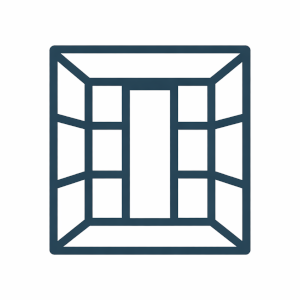
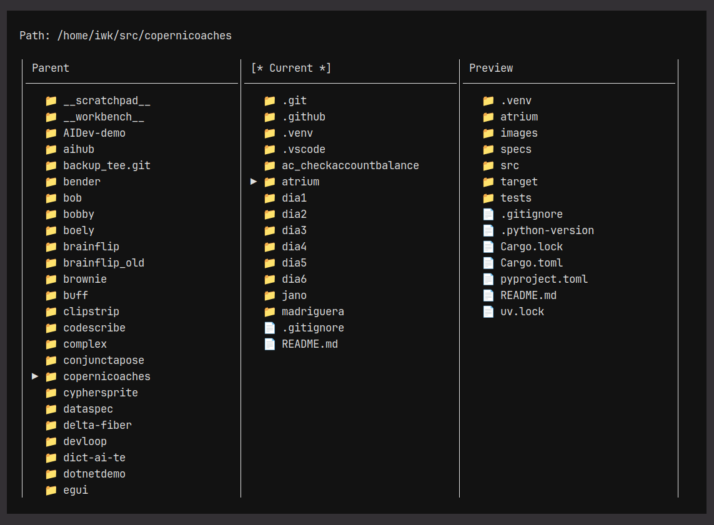
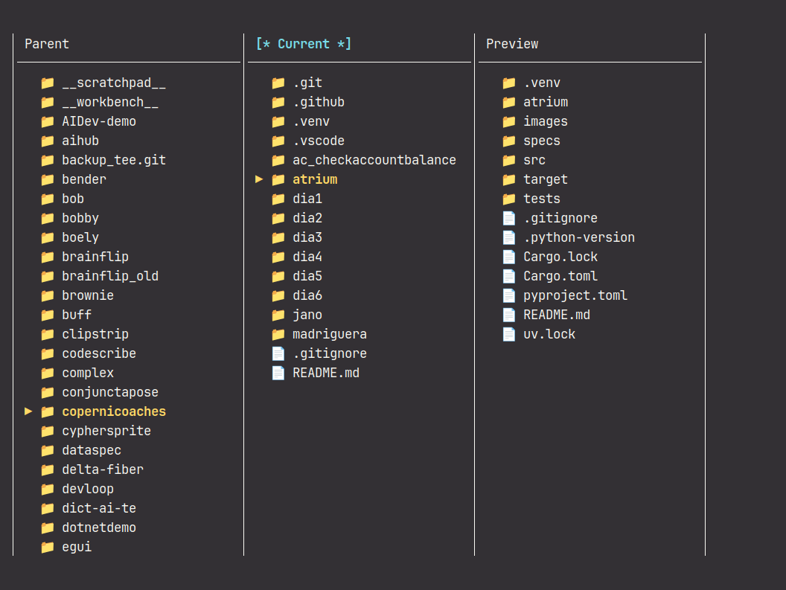

# Atrium

[](LICENSE)
[](FOSS_PLURALISM_MANIFESTO.md)
[](https://www.python.org)
[](https://www.rust-lang.org)
[](https://www.kernel.org)
[](https://www.apple.com/macos)
[](https://www.microsoft.com/windows)



Atrium is a console file manager using a [Miller Columns layout](https://en.wikipedia.org/wiki/Miller_columns) (also see [Grokpidia](https://grokipedia.com/page/Miller_columns)), available in two implementations: Python (Textual) and Rust (crossterm).

This first version is a view-only demonstrator: it focuses on navigation and preview, and does not perform file operations.

🍀 Confirmed on Linux and macOS. Windows should work, but has not been verified yet.

It keeps three levels visible at once:

- **left**: parent directory contents
- **center**: current directory contents
- **right**: preview of the selected entry

If the selected entry is a file, the right column shows file metadata and a text preview when available.

---

## Requirements

### Python requirements

- Python 3.13+
- `uv`

### Rust requirements

- Rust (stable toolchain)
- `cargo`

---

## Installation

### Python installation

Clone the repository and install dependencies:

```bash
uv sync
```

### Rust installation

Build the binary:

```bash
cargo build --release
```

---

## Usage

### Running Python

```bash
uv run python -m atrium
```



### Running Rust

```bash
cargo run --release
```




Both implementations start in the current working directory. To start from a specific path, `cd` there first:

```bash
cd /path/to/start
uv run python -m atrium   # Python
cargo run --release        # Rust
```

---

## Keyboard controls

| Key                     | Action                   |
|-------------------------|--------------------------|
| `↑` / `↓`               | Move selection up / down |
| `→` or `Enter`          | Enter selected directory |
| `←` or `Backspace`      | Go to parent directory   |
| `q` or `Ctrl-C`         | Quit                     |

---

## Development

### Python tests

```bash
uv run python -m unittest discover -s tests -v
```

### Rust tests

```bash
cargo test
```

---

## Project structure

```text
atrium/
├── atrium/               # Python package
│   ├── filesystem.py     # filesystem adapter
│   ├── state.py          # navigation state
│   ├── controller.py     # keyboard-driven navigation logic
│   ├── display.py        # display projection and text renderer
│   └── app.py            # Textual application
├── src/                  # Rust crate
│   ├── filesystem.rs     # filesystem adapter
│   ├── state.rs          # navigation state
│   ├── controller.rs     # keyboard-driven navigation logic
│   ├── display.rs        # display projection and text renderer
│   ├── app.rs            # application loop (crossterm)
│   └── main.rs           # entry point
├── tests/                # test suite (Python + Rust)
├── specs/
│   ├── python/           # specs for the Python implementation
│   └── rust/             # specs for the Rust implementation
├── pyproject.toml
└── Cargo.toml
```

## Principles of Participation

Everyone is invited and welcome to contribute: open issues, propose pull requests, share ideas, or help improve documentation. Participation is open to all, regardless of background or viewpoint. 

This project follows the [FOSS Pluralism Manifesto](./FOSS_PLURALISM_MANIFESTO.md), which affirms respect for people, freedom to critique ideas, and space for diverse perspectives. 

## License and Copyright

Copyright (c) 2026, Iwan van der Kleijn

This project is licensed under the MIT License. See the [LICENSE](LICENSE) file for details.